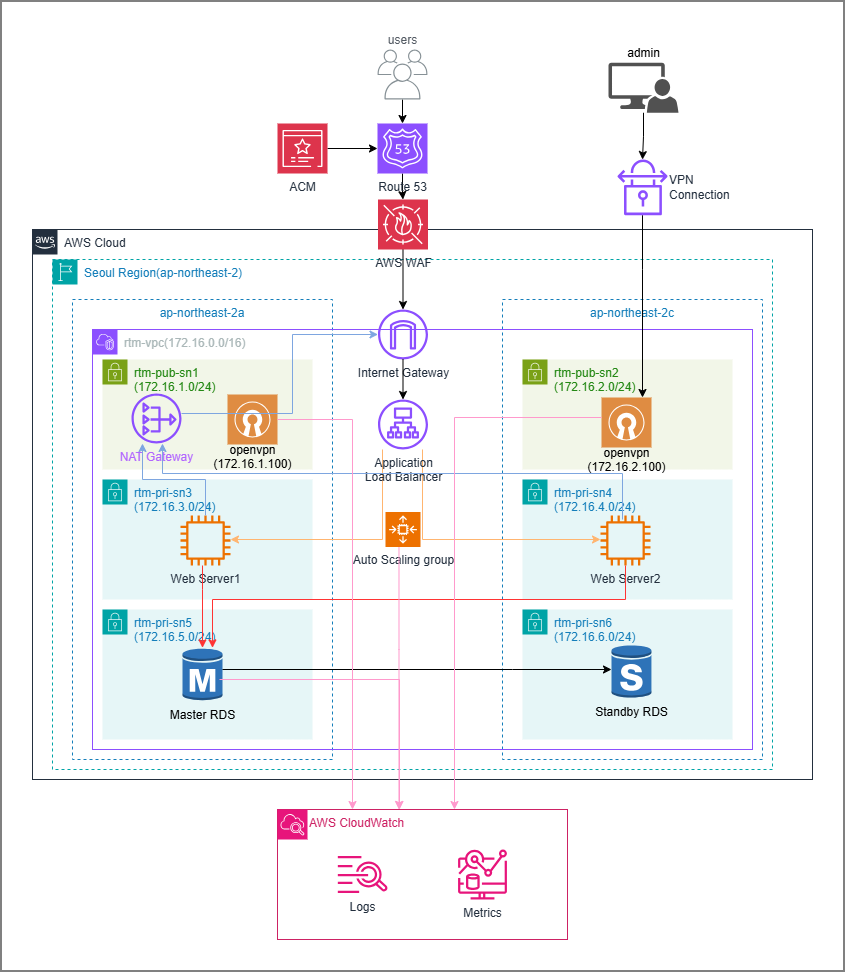

# 주제: AWS CloudWatch를 이용한 고가용성 모니터링 및 실시간 장애 대응 서비스
> [!NOTE]
> **프로젝트 기간:** 2026.05.11-2026.06.12 / **난이도:** ★★★★☆

## 주제로 선정한 이유
- 이유1
- 이유2
- 이유3

## 최신 동향과 발전 과제
- 이유1
- 이유2

## 프로젝트 구성도

## 구성표
- AWS VPC 자원 구성표
    
    
    | 번호 | 자원명 | 태그명 | 세부내용 |
    | --- | --- | --- | --- |
    | 1 | VPC | rtm-vpc | 172.16.0.0/16 |
    | 2 | Internet Gateway | rtm-igw | rtm-vpc 연결 |
    | 3 | Subnet | rtm-pub-sn1 | ap-northeast-2a 172.16.1.0/24 |
    | 4 | Subnet | rtm-pub-sn2 | ap-northeast-2c 172.16.2.0/24 |
    | 5 | Subnet | rtm-pri-sn3 | ap-northeast-2a 172.16.3.0/24 |
    | 6 | Subnet | rtm-pri-sn4 | ap-northeast-2c 172.16.4.0/24 |
    | 7 | Subnet | rtm-db-sn5 | ap-northeast-2a 172.16.5.0/24 |
    | 8 | Subnet | rtm-db-sn6 | ap-northeast-2c 172.16.6.0/24 |
    | 9 | Route Table | rtm-pub-rt12 | rtm-pub-sn1 연결 rtm-pub-sn2 연결 기본경로: rtm-igw |
    | 10 | Route Table | rtm-pri-rt34 | rtm-pri-sn3 연결 rtm-pri-sn4 연결 기본경로: rtm-nat-gw |
    | 11 | Route Table | rtm-db-rt56 | rtm-db-sn5 연결 rtm-db-sn6 연결 기본경로: 없음 |
    | 12 | Elastic IP | rtm-nat-eip | rtm-nat-gw 연결 |
    | 13 | NAT Gateway | rtm-nat-gw | rtm-nat-eip 사용 rtm-pri-rt34의 기본경로 최소 2분 소요 |
    | 14 | Key Pair | rtm-key |  |
- AWS OpenVPN Access Server 자원 구성표
    
    
    | 번호 | 자원명 | 태그명 | 세부내용 |
    | --- | --- | --- | --- |
    | 1 | Security Group | rtm-openvpn-sg | 22,80,443,943,945,1194: 전 세계 허용 |
    | 2 | Elastic IP | rtm-openvpn-eip1 |  |
    | 3 | OpenVPN Access Server | rtm-openvpn1 | rtm-pub-sn1 rtm-openvpn-eip1 172.16.1.100 rtm-openvpn-sg |
    | 4 | Elastic IP | rtm-openvpn-eip2 |  |
    | 5 | OpenVPN Access Server | rtm-openvpn2 | rtm-pub-sn2 rtm-openvpn-eip2 172.16.2.100 rtm-openvpn-sg |
- AWS EC2 자원 구성표
    
    
    | 번호 | 자원명 | 태그명 | 세부내용 |
    | --- | --- | --- | --- |
    | 1 | Security Group | rtm-alb-sg | HTTP: 0.0.0.0/ 허용 HTTPS: 0.0.0.0/ 허용 |
    | 2 | Target Group | rtm-web-tg | 대상 없음 상태검사: /login.php 상태검사주기: 10초 Healthy: 3 Unhealthy: 3 |
    | 3 | Application Load Balancer | rtm-web-alb | 인터넷 경계 rtm-pub-sn1, rtm-pub-sn2 위치 |
    | 4 | Security Group | rtm-web-sg | SSH: 172.16.0.0/16 HTTP: rtm-alb-sg 허용 HTTPS: rtm-alb-sg 허용 ICMP: 172.16.1.100, 172.16.2.100 허용 |
    | 5 | Launch Template1 | rtm-web-lt | Amazon Linux 2023 kernel-6.1 AMI t3.micro rtm-weg-tg rtm-key rtm-web-sg |
    | 6 | Auto Scaling Group | rtm-web-asg | rtm-web-lt rtm-web-tg rtm-pri-sn3 rtm-pri-sn4 용량: 2 최소: 2 최대: 4 Target Tracking Scaling: 50% |

## 프로젝트 목표:
1. CloudFormation 템플릿을 사용한 AWS 기본 인프라 구축
2. OpenVPN Access Server를 활용한 안전한 원격 접속 환경 구축
3. ALB와 서브넷별 Openvpn 인스턴스를 통한 고가용성 확보
4. Auto Scaling Group을 통한 탄력적 운영 구현
5. ACM과 WAF를 활용한 웹서비스 보안 강화
6. EC2 + Apache + PHP 프론트엔드 구현
7. RDS를 활용한 회원가입 및 로그인 플랫폼 구축

## 프로젝트 일정계획
| 일차 | 날짜 | 내용 |
| --- | --- | --- |
| 1일차 |  | AWS 클라우드 프로젝트를 위한 사례 연구 프로젝트 주제 및 목표 설정 프로젝트 구성도 생성 |
| 2일차 |  | CloudFormation 템플릿을 사용한 AWS 기본 인프라 구축 OpenVPN Access Server를 활용한 안전한 원격 접속 환경 구축 ALB와 서브넷별 Openvpn 인스턴스를 통한 고가용성 확보 Auto Scaling Group을 통한 탄력적 운영 구현 ACM과 WAF를 활용한 웹서비스 보안 강화|
| 3일차 |  | EC2 + Apache + PHP 프론트엔드 구현 CloudWatch를 활용한 서버 모니터링 시각화 플랫폼 구축 결과 테스트 |
| 4일차 |  | 프로젝트 결과 정리 PPT 제작 |
| 5일차 |  | 프로젝트 결과 정리 PPT 제작 |

## 세부 내용:
1. 리전의 웹 서버는 ALB를 이용해 고가용성을 구성
2. 리전의 웹 서버는 Auto Scaling Group을 이용해 탄력적으로 확장되도록 구성
3. 서울 리전은 NAT Gateway를 사용
4. 서울 리전에 OpenVPN 인스턴스 2대를 설치하여 프라이빗 망을 구성
5. OpenVPN 및 전체 웹 서버는 각 리전의 키 페어(seoul-key)로 SSH 접속이 가능하도록 구성
6. 웹 클라이언트는 Route 53 DNS를 통해 웹 서버에 접속하도록 구성
---
Copyright (C) 2026. WJEONG
